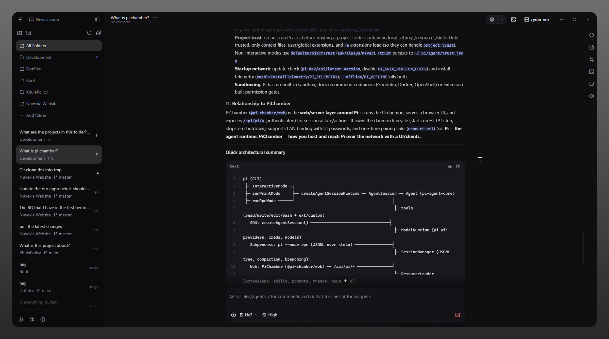

<p align="center">
  
</p>

## Run agent work. Keep control. Ship from anywhere.

**PiChamber is an open-source workspace for running and supervising [Pi Coding Agent](https://pi.dev) work from desktop or a browser.**

PiChamber runs a Pi-native session daemon on the host, provides an authenticated web API, and lets trusted devices connect to the same server.



## What you can do

- Create, resume, rename, fork, clone, archive, and delete Pi sessions.
- Follow live assistant, reasoning, and tool output; steer, queue, or abort work.
- Configure Pi providers, models, prompt templates, skills, project trust, and `AGENTS.md` resources without exposing stored credentials to the browser.
- Connect desktop and browser clients to a local or self-hosted PiChamber server.
- Pair trusted devices with one-time connection links and protect server access with a UI password.

## Quick start

### Desktop — macOS, Windows, and Linux

Download the latest **desktop** release from [GitHub Releases](https://github.com/RyderAsKing/PiChamber/releases/latest). The first public line (`0.1.0`) ships Electron only. Desktop includes the Pi SDK integration; it does not require a separately installed Pi CLI or server.

Linux releases are available as x86_64 and ARM64 AppImages. Make the downloaded AppImage executable and keep it in a writable location for in-app updates:

```bash
chmod +x PiChamber-*.AppImage
./PiChamber-*.AppImage
```

Linux AppImages require FUSE (`libfuse.so.2`). Without FUSE, run with `APPIMAGE_EXTRACT_AND_RUN=1`.

### Server — Web and PWA

Requires Node.js 22+.

```bash
curl -fsSL https://raw.githubusercontent.com/RyderAsKing/PiChamber/main/scripts/install.sh | bash
pichamber serve --ui-password be-creative-here
```

Common operations:

```bash
pichamber status
pichamber connect-url --qr
pichamber startup enable
pichamber logs
pichamber stop
pichamber update
```

PiChamber binds to localhost by default. Use `--lan` only on a trusted network and protect browser access with `--ui-password`.

## Guides

- [Quick start](packages/docs/content/docs/quickstart.mdx)
- [Installation](packages/docs/content/docs/install.mdx)
- [Connect devices](packages/docs/content/docs/connect-devices.mdx)
- [Security](packages/docs/content/docs/security.mdx)
- [Troubleshooting](packages/docs/content/docs/troubleshooting.mdx)

For self-hosting details, see the [reverse proxy guide](docs/REVERSE_PROXY.md).

## Contributing

> **Not accepting contributions right now.** PiChamber is in an early phase of its Pi port. Issues and pull requests are welcome, but responses may take time.

See [CONTRIBUTING.md](./CONTRIBUTING.md) for development setup and contribution guidelines. Documentation authoring guidance lives in [`packages/docs`](packages/docs/README.md).

## Acknowledgments

PiChamber is a community fork of [OpenChamber](https://github.com/openchamber/openchamber) by Bohdan Triapitsyn. We retain its required MIT attribution. Thanks also to Pi Coding Agent, Pierre, Ghostty-web, and every contributor who shaped the project.

## License

MIT. See [LICENSE](./LICENSE) for the joint copyright notice.
