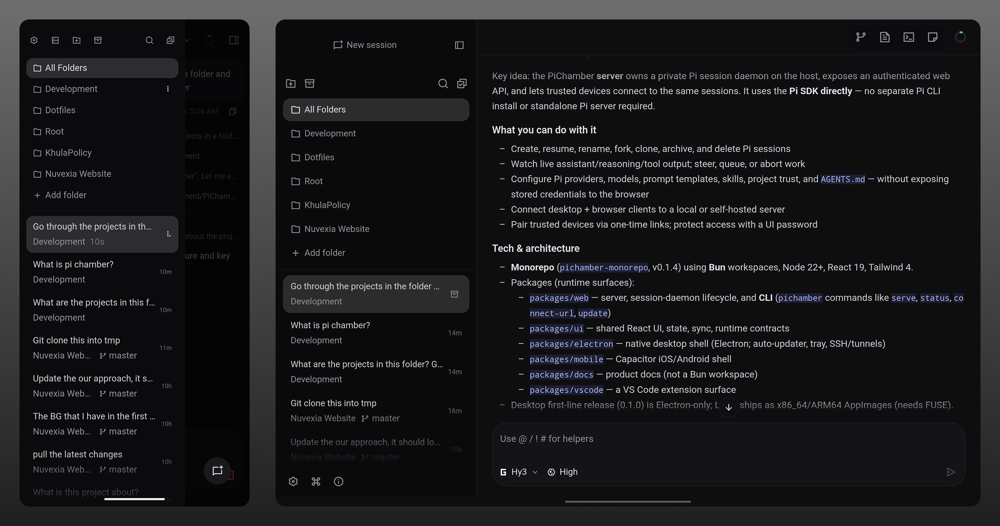

<p align="center">
  
</p>

## Run agent work. Keep control. Ship from anywhere.

**PiChamber is an open-source workspace for [Pi Coding Agent](https://pi.dev) that lets you run Pi from desktop or a browser and reach it from anywhere.**




## Why PiChamber?

I loved [OpenChamber](https://github.com/openchamber/openchamber). But I could not ignore what a stripped and minimal harness like [Pi](https://pi.dev) does for performance and cost.

Pi is minimal by design. Small system prompt, no baked in sub agents or plan mode. You add what you need via [Extensions, Skills, Prompts and Themes](https://pi.dev). It runs in 4 modes, interactive, print, JSON, RPC and SDK, supports 40+ providers and any custom provider that speaks OpenAI, Anthropic or Google APIs, and stays fast because it does not dictate your workflow. See all the details at [pi.dev](https://pi.dev).

[Composio](https://x.com/composio) put it to the test. On a 30 task agentic eval with DeepSeek V4 Flash across 4 harnesses, Pi was the most capable and the cheapest.


DeepSeek V4 Flash, 4 Agent Harnesses

| Agent Harness | Pass Rate | Median Cost / Task | Median Time / Task |
|---|---|---|---|
| Pi Agent | 66.7% | $0.012 | 132s |
| Prime Agent | 62.5% | $0.045 | 242s |
| Deep Agents | 53.3% | $0.018 | 187s |
| Hermes Agent | 50.0% | $0.017 | 176s |

Source: [Composio agentic eval](https://x.com/composio/status/2086814488162972027)

Rankings

* Pass rate: Pi (66.7%) > Prime (62.5%) > Deep (53.3%) > Hermes (50.0%)
* Cheapest: Pi ($0.012) > Hermes ($0.017) > Deep ($0.018) > Prime ($0.045)
* Fastest: Pi (132s) > Hermes (176s) > Deep (187s) > Prime (242s)

The standout is Pi Agent. It has the highest pass rate, lowest cost, and lowest median completion time in this evaluation.

Second eval with DeepSeek V4 Pro was the same story. Pi solved the most tasks across Claude Code, DeepSeek Harness, Hermes, Pi and OpenCode. Details at [x.com/composio/status/2090069397050097864](https://x.com/composio/status/2090069397050097864?s=20).

**This is why I made Pi and PiChamber.**

PiChamber is not a bloated UI filled with features. It follows the footsteps of Pi, minimal, fast and hackable. All existing Pi extensions work in PiChamber. Soon you will be able to ship custom GUI for extensions that renders inside PiChamber, the same way Pi lets you build your own tools.

Run it on your PC, or on a server, and connect from your phone or tablet. Same sessions, same daemon, over an authenticated web API with one time pairing links.

## What you can do

- Create, resume, fork, archive, and delete Pi sessions, steer or abort live work
- Watch reasoning, tools, and token usage stream in real time
- Configure 40+ providers, any custom provider, skills, `AGENTS.md` and trust, credentials never leave the host
- Pair desktop, browser and mobile to one PiChamber server

## Quick start

**Desktop:** Download from [GitHub Releases](https://github.com/RyderAsKing/PiChamber/releases/latest), no separate Pi CLI needed.

**Server:**
```bash
bun add -g @pi-chamber/web
pichamber serve --ui-password be-creative-here
```
Not using Bun? See [Install docs](packages/docs/content/docs/install.mdx) for npm, pnpm, yarn and `bunx`/`npx`.

From source: `bun install` then `bun run dev` or `bun run electron:dev`, see [CONTRIBUTING.md](./CONTRIBUTING.md).

## Guides

[Quick start](packages/docs/content/docs/quickstart.mdx) • [Install](packages/docs/content/docs/install.mdx) • [Connect devices](packages/docs/content/docs/connect-devices.mdx) • [Security](packages/docs/content/docs/security.mdx)

## Acknowledgments

PiChamber is a community fork of [OpenChamber](https://github.com/openchamber/openchamber) by Bohdan Triapitsyn, now running through its Pi-native session daemon. We retain its required MIT attribution. Thanks to Pi Coding Agent, Pierre, Ghostty-web and every contributor who shaped the project.

## License

MIT, [LICENSE](./LICENSE)
