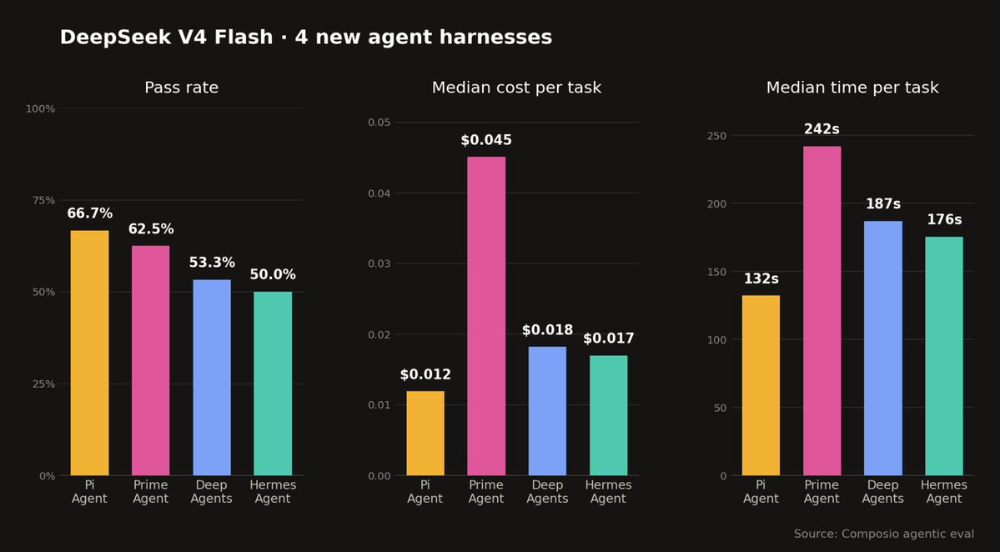
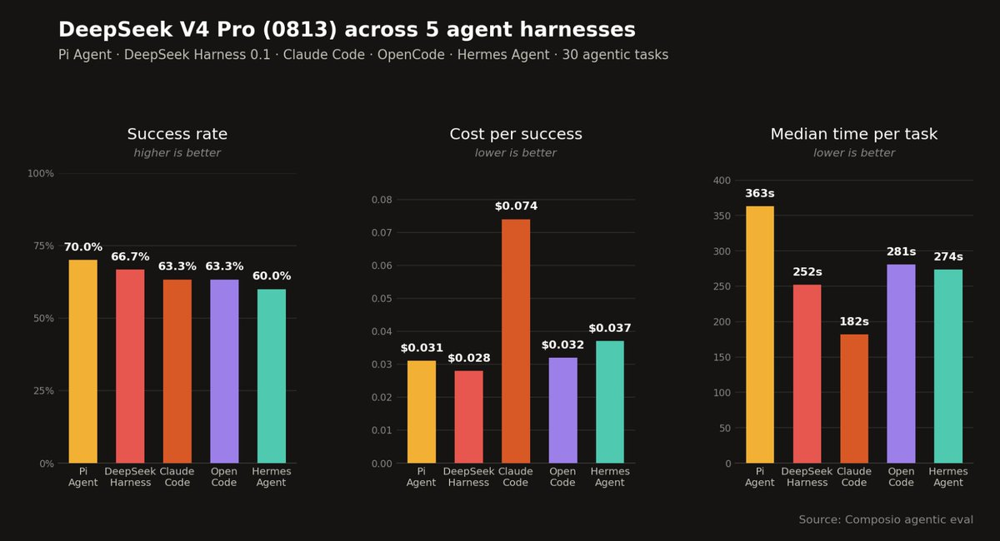

<p align="center">
  
</p>

<h1 align="center">PiChamber</h1>

<p align="center">Run agent work. Keep control. Ship from anywhere.</p>

**PiChamber is an open-source workspace for [Pi Coding Agent](https://pi.dev). Run Pi from a desktop app or browser, then connect trusted devices to the same server.**


## Why PiChamber?

PiChamber started as a community fork of [OpenChamber](https://github.com/openchamber/openchamber), but the project has since been substantially rewritten around the Pi SDK. PiChamber owns the workspace, authentication, device connections, and native shells, while Pi owns sessions, providers, prompts, skills, and the session daemon.

PiChamber uses the Pi SDK as its agent runtime. It adds the workspace around Pi, including session navigation, live output, project files, authentication, trusted device connections, and native shells. Pi continues to own the agent itself, along with providers, prompts, skills, extensions, and themes.

An independent [Composio evaluation](https://x.com/composio/status/2086814488162972027) compared Pi with several other agent harnesses. Pi had the highest pass rate, lowest median cost, and lowest median completion time in the cited DeepSeek V4 Flash run.



A second [DeepSeek V4 Pro evaluation](https://x.com/composio/status/2090069397050097864) reported the same ranking for the tested tasks. These are external results, not PiChamber benchmarks.



PiChamber stays focused on the parts around the agent:

- Create, resume, fork, archive, and delete Pi sessions
- Watch reasoning, tools, and token usage as they arrive
- Use Pi providers, extensions, skills, prompts, `AGENTS.md`, and project trust
- Pair a desktop, browser, or mobile device with one PiChamber server
- Run the server on your own machine or a host you control

## Quick start

**Desktop:** Download the latest app from [GitHub Releases](https://github.com/RyderAsKing/PiChamber/releases/latest). The desktop app starts the PiChamber server and Pi session daemon in-process, so it does not need a separate Pi CLI installation.

**Server:**

```bash
bun add -g @pi-chamber/web
pichamber serve --ui-password be-creative-here
```

Not using Bun? See the [install docs](packages/docs/content/docs/install.mdx) for npm, pnpm, yarn, and `bunx`/`npx` options.

From source:

```bash
bun install
bun run dev
```

See [CONTRIBUTING.md](./CONTRIBUTING.md) for the development and release workflow.

## Guides and community

[Quick start](packages/docs/content/docs/quickstart.mdx) · [Install](packages/docs/content/docs/install.mdx) · [Connect devices](packages/docs/content/docs/connect-devices.mdx) · [Security](packages/docs/content/docs/security.mdx) · [Contributing](CONTRIBUTING.md)

- [GitHub Discussions](https://github.com/RyderAsKing/PiChamber/discussions)
- [Security policy](SECURITY.md)

## Acknowledgments

PiChamber retains the required MIT attribution for [OpenChamber](https://github.com/openchamber/openchamber) by Bohdan Triapitsyn. Thanks to Pi Coding Agent, Pierre, xterm.js, and every contributor who has shaped the project.

## License

MIT, [LICENSE](./LICENSE)
